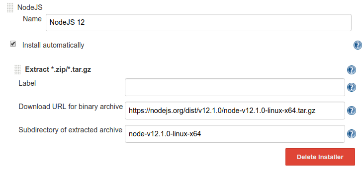

# Jenkins Puppeteer Docker

## Build and run the docker image

- Run `npm run docker:build`
- Run `npm run docker:run`
- Open http://localhost:8080

## Setting up jenkins

- Install the [NodeJS Plugin](https://wiki.jenkins.io/display/JENKINS/NodeJS+Plugin) in `Jenkins > Plugin Manager`
- Add some NodeJS installations to `Jenkins > Global Tool Configuration`

## Install nodejs 12

_You only have to do this as long as nodejs 12 is not available through the nodejs plugin._

- Download URL **https://nodejs.org/dist/v12.1.0/node-v12.1.0-linux-x64.tar.gz**
- Subdirectory **node-v12.1.0-linux-x64**

